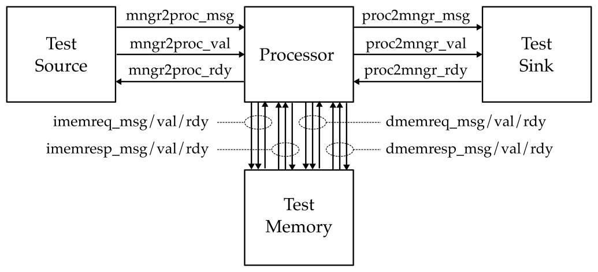
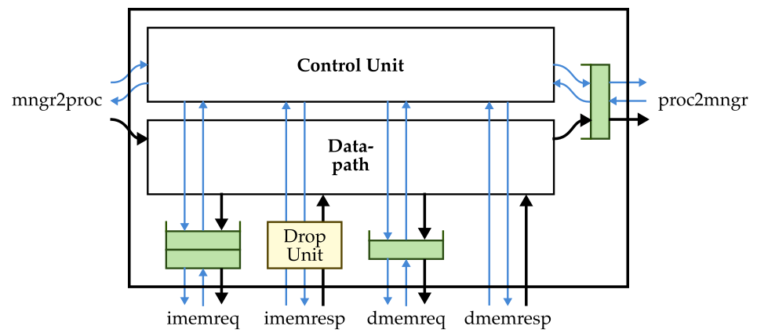

ECE 4750 Section 4: Lab 2 Head Start
==========================================================================

 - Author: Christopher Batten
 - Date: September 16, 2022

**Table of Contents**

 - TinyRV2 Processor Walk-Through
 - Testing the ADD Instruction
 - Implementing and Testing the ADDI Instruction
 - Evaluating an Accumulate Function

This discussion section serves to introduce students to the basic
processor modeling approach and testing strategy we will be using to
implement a pipelined TinyRV2 processor in lab 2. You should log into the
`ecelinux` servers using the remote access option of your choice and then
source the setup script.

    % source setup-ece4750.sh
    % mkdir -p $HOME/ece4750
    % cd $HOME/ece4750
    % git clone git@github.com:cornell-ece4750/ece4750-sec04-proc sec04
    % cd sec04
    % TOPDIR=$PWD
    % mkdir $TOPDIR/build

TinyRV2 Processor Walk-Through
--------------------------------------------------------------------------

The following figure shows the high-level interface for our TinyRV2
processor. The procesor has an independent instruction memory and data
memory interface along with a mngr2proc and proc2mngr stream interface
for testing purposes. All interfaces are implemented using the
latency-insensitive val/rdy micro-protocol.

We provide students a complete functional-level model of a processor that
implements the above interface and can be used as a reference. You can
find the FL model in `lab2_proc/ProcFL.py`. This is what the interface
looks like in Verilog for an RTL implementation of the TinyRV2 process.

    module lab2_proc_ProcSimple
    #(
      parameter p_num_cores = 1
    )
    (
      input  logic         clk,
      input  logic         reset,

      // From mngr streaming port

      input  logic [31:0]  mngr2proc_msg,
      input  logic         mngr2proc_val,
      output logic         mngr2proc_rdy,

      // To mngr streaming port

      output logic [31:0]  proc2mngr_msg,
      output logic         proc2mngr_val,
      input  logic         proc2mngr_rdy,

      // Instruction Memory Request Port

      output mem_req_4B_t  imem_reqstream_msg,
      output logic         imem_reqstream_val,
      input  logic         imem_reqstream_rdy,

      // Instruction Memory Response Port

      input  mem_resp_4B_t imem_respstream_msg,
      input  logic         imem_respstream_val,
      output logic         imem_respstream_rdy,

      // Data Memory Request Port

      output mem_req_4B_t  dmem_reqstream_msg,
      output logic         dmem_reqstream_val,
      input  logic         dmem_reqstream_rdy,

      // Data Memory Response Port

      input  mem_resp_4B_t dmem_respstream_msg,
      input  logic         dmem_respstream_val,
      output logic         dmem_respstream_rdy,

      // extra ports

      input  logic [31:0]  core_id,
      output logic         commit_inst,
      output logic         stats_en

    );

Notice there are some extra ports to set the core id and for statistics,
and that we are using SystemVerilog structs to encode the memory requests
and responses. Here is the memory request struct format:

     76  74 73           66 65              34 33  32 31               0
    +------+---------------+------------------+------+------------------+
    | type | opaque        | addr             | len  | data             |
    +------+---------------+------------------+------+------------------+

And here is the memory response struct format:

     46  44 43           36 35  34 33  32 31               0
    +------+---------------+------+------+------------------+
    | type | opaque        | test | len  | data             |
    +------+---------------+------+------+------------------+

The full TinyRV2 instruction set includes the following instructions:

 - CSR: `csrr, csrw`
 - Reg-Reg: `add, sub, mul, and, or, xor, slt, sltu, sra, srl, sll`
 - Reg-Imm: `addi, ori, andi, xori, slti, sltiu, srai, srli, slli, lui, auipc`
 - Memory: `lw, sw`
 - Jump: `jal, jalr`
 - Branch: `bne, beq, blt, bltu, bge, bgeu`

In this discussion section, we provide you a simple processor
implementation that implements ADD, LW, BNE, CSRR, and CSRW. The block
diagram for how the control unit and datapath unit are composed is shown
below.

The datapath for this simple processor is shown below.

Take a look at the code in the following files to learn more about how
the simple processor is implemented.

 - `lab2_proc/ProcSimpleDpath.v`
 - `lab2_proc/ProcSimpleCtrl.v`
 - `lab2_proc/ProcSimple.v`

Testing the ADD Instruction
--------------------------------------------------------------------------

Let's take a look at a basic test for the ADD instruction. They primary
way we will test our processors is by writing very small _assembly test
programs_. Take a look at the test in
`lab2_proc/test/simple_add_test.py` to see how to write such assembly
test programs.

    def test_add_sm( cmdline_opts ):

      prog="""
        csrr x1, mngr2proc < 5
        csrr x2, mngr2proc < 4
        nop
        nop
        nop
        nop
        nop
        nop
        nop
        nop
        add x3, x1, x2
        nop
        nop
        nop
        nop
        nop
        nop
        nop
        nop
        csrw proc2mngr, x3 > 9
        nop
        nop
        nop
        nop
        nop
        nop
        nop
        nop
      """

      run_test( ProcSimple, prog, cmdline_opts=cmdline_opts )

Our assembly test program is just a multiline string with one assembly
instruction per line, which we can then pass in to the `run_test` helper
function. There are two special control status registers (CSR) that we
will use extensively in testing. If we read the `mngr2proc` CSR using a
CSRR instruction, then this deques a message from the `mngr2proc` stream
interface (the message comes from the stream source) and writes it to the
given general purpose register. If we write the `mngr2proc` CSR using a
CSRW instruction, then this enqueues a message onto the `proc2mngr`
stream interface (the message goes to the stream sink). We can use the
`<` symbol to specify in the assembly code what value we want the stream
source to send to the processor for that instruction, and we can use the
`>` symbol to specify in the assembly code what value we want the stream
sink to check for that instruction.

You should always make sure your tests pass on the FL model before using
them to test your RTL model. Let's run the above test on our FL model.

    % cd $TOPDIR/build
    % pytest ../lab2_proc/test/simple_add_test.py -s

Use the `-s` command line option so you can see the linetrace. Verify
that the instructions you think should be executing are indeed executing
on the FL model. Now let's try the same test on the simple processor.
Modify `run_test` to use the `ProcSimple` like this:

  run_test( ProcSimple, prog, cmdline_opts=cmdline_opts )

Then rerun the test and look at the line trace. It should look something
like this:

     1r .        >          |                       |    |    |    |[ ]                         >                  [  ]| >
     2r .        >          |                       |    |    |    |[ ]                         >                  [  ]| >
     3: .        >          |                       |    |    |    |[ ]rd:00:00000200:0:        >                  [  ]| >
     4: #        >  00000200|                       |    |    |    |[ ]rd:00:00000204:0:        >rd:00:0:0:fc0020f3[ *]| >
     5: 00000005 >  00000204|csrr   x01, mngr2proc  |    |    |    |[ ]rd:00:00000208:0:        >rd:00:0:0:fc002173[ *]| >
     6: 00000004 >  00000208|csrr   x02, mngr2proc  |csrr|    |    |[ ]rd:00:0000020c:0:        >rd:00:0:0:00000013[ *]| >
     7: .        >  0000020c|nop                    |csrr|csrr|    |[ ]rd:00:00000210:0:        >rd:00:0:0:00000013[ *]| >
     8: .        >  00000210|nop                    |nop |csrr|csrr|[ ]rd:00:00000214:0:        >rd:00:0:0:00000013[ *]| >
     9: .        >  00000214|nop                    |nop |nop |csrr|[ ]rd:00:00000218:0:        >rd:00:0:0:00000013[ *]| >
    10: .        >  00000218|nop                    |nop |nop |nop |[ ]rd:00:0000021c:0:        >rd:00:0:0:00000013[ *]| >
    11: .        >  0000021c|nop                    |nop |nop |nop |[ ]rd:00:00000220:0:        >rd:00:0:0:00000013[ *]| >
    12: .        >  00000220|nop                    |nop |nop |nop |[ ]rd:00:00000224:0:        >rd:00:0:0:00000013[ *]| >
    13: .        >  00000224|nop                    |nop |nop |nop |[ ]rd:00:00000228:0:        >rd:00:0:0:00000013[ *]| >
    14: .        >  00000228|nop                    |nop |nop |nop |[ ]rd:00:0000022c:0:        >rd:00:0:0:002081b3[ *]| >
    15: .        >  0000022c|add    x03, x01, x02   |nop |nop |nop |[ ]rd:00:00000230:0:        >rd:00:0:0:00000013[ *]| >
    16: .        >  00000230|nop                    |add |nop |nop |[ ]rd:00:00000234:0:        >rd:00:0:0:00000013[ *]| >
    17: .        >  00000234|nop                    |nop |add |nop |[ ]rd:00:00000238:0:        >rd:00:0:0:00000013[ *]| >
    18: .        >  00000238|nop                    |nop |nop |add |[ ]rd:00:0000023c:0:        >rd:00:0:0:00000013[ *]| >
    19: .        >  0000023c|nop                    |nop |nop |nop |[ ]rd:00:00000240:0:        >rd:00:0:0:00000013[ *]| >
    20: .        >  00000240|nop                    |nop |nop |nop |[ ]rd:00:00000244:0:        >rd:00:0:0:00000013[ *]| >
    21: .        >  00000244|nop                    |nop |nop |nop |[ ]rd:00:00000248:0:        >rd:00:0:0:00000013[ *]| >
    22: .        >  00000248|nop                    |nop |nop |nop |[ ]rd:00:0000024c:0:        >rd:00:0:0:00000013[ *]| >
    23: .        >  0000024c|nop                    |nop |nop |nop |[ ]rd:00:00000250:0:        >rd:00:0:0:7c019073[ *]| >
    24: .        >  00000250|csrw   proc2mngr, x03  |nop |nop |nop |[ ]rd:00:00000254:0:        >rd:00:0:0:00000013[ *]| >
    25: .        >  00000254|nop                    |csrw|nop |nop |[ ]rd:00:00000258:0:        >rd:00:0:0:00000013[ *]| >
    26: .        >  00000258|nop                    |nop |csrw|nop |[ ]rd:00:0000025c:0:        >rd:00:0:0:00000013[ *]| >
    27: .        >  0000025c|nop                    |nop |nop |csrw|[ ]rd:00:00000260:0:        >rd:00:0:0:00000013[ *]| > 00000009
    28: .        >  00000260|nop                    |nop |nop |nop |[ ]rd:00:00000264:0:        >rd:00:0:0:00000013[ *]| >
    29: .        >  00000264|nop                    |nop |nop |nop |[ ]rd:00:00000268:0:        >rd:00:0:0:00000013[ *]| >
    30: .        >  00000268|nop                    |nop |nop |nop |[ ]rd:00:0000026c:0:        >rd:00:0:0:00000013[ *]| >
    31: .        >  0000026c|nop                    |nop |nop |nop |[ ]rd:00:00000270:0:        >rd:00:0:0:00000013[ *]| >
    32: .        >  00000270|nop                    |nop |nop |nop |[ ]rd:00:00000274:0:        >rd:00:0:0:fc0020f3[ *]| >

Now add a new test function to `lab2_proc/test/simple_add_test.py` named
`test_add_lg` which is similar to `test_add_sm` but uses two larger input
values. Verify your test passes on both `ProcFL` and `ProcSimple`.

Implementing and Testing the ADDI Instruction
--------------------------------------------------------------------------

Now let's add the ADDI instruction to our simple processor. It is
critical to always take an incremental approach. Add a single instruction
to your processor. Do lots of testing and only once you are confident you
have covered all of the corner cases should you move on to adding another
instruction.

Use the given handout to plan your implementation. Make sure you
understand how the control signals are set for the ADD instruction. Draw
any modifications you need to the datapath, add any control signals you
need to the control signal table, and then fill out the row in the
control signal table for the ADDI instruction. Once you have the control
signal table filled out on paper, go ahead and add a new row to the
control signal table in `lab2_proc/ProcSimpleCtrl.v`:

    always_comb begin
      casez ( inst_D )
        //                            br      imm   rs1 op2    rs2 alu      dmm wbmux rf
        //                       val  type    type   en muxsel  en fn       typ sel   wen csrr csrw
        `TINYRV2_INST_NOP     :cs( y, br_na,  imm_x, n, bm_x,   n, alu_x,   nr, wm_a, n,  n,   n    );
        `TINYRV2_INST_ADD     :cs( y, br_na,  imm_x, y, bm_rf,  y, alu_add, nr, wm_a, y,  n,   n    );
        `TINYRV2_INST_LW      :cs( y, br_na,  imm_i, y, bm_imm, n, alu_add, ld, wm_m, y,  n,   n    );
        `TINYRV2_INST_BNE     :cs( y, br_bne, imm_b, y, bm_rf,  y, alu_x,   nr, wm_a, n,  n,   n    );
        `TINYRV2_INST_CSRR    :cs( y, br_na,  imm_i, n, bm_csr, n, alu_cp1, nr, wm_a, y,  y,   n    );
        `TINYRV2_INST_CSRW    :cs( y, br_na,  imm_i, y, bm_rf,  n, alu_cp0, nr, wm_a, n,  n,   y    );
      endcase
    end

Create a new test case in `lab2_proc/test/simple_addi_test.py` similar in
spirit to the test cases we used to test the ADD instruction. Then run
your test case on both `ProcFL` and `ProcSimple`. Look at the line trace
to confirm your test case is doing what you expect on `ProcSimple`.

    % cd $TOPDIR/build
    % pytest ../lab2_proc/test/simple_addi_test.py -v

Writing assembly test cases can be very tedious. We can use the Python to
help automate the process of _generating_ test cases. You can see an
example of functions that generate assembly test programs in
`inst_add.py` and then you can see using these test programs in
`ProcSimple_test.py`. Go ahead and run all of the provided tests on
`ProcFL` and `ProcSimple` like this:

    % cd $TOPDIR/build
    % pytest ../lab2_proc/test -v

Evaluating an Accumulate Function
--------------------------------------------------------------------------

Now let's try to run the assembly for a simple C function on the simple
processor and start to look at its performance. Write out the TinyRV2
assembly code that implements this C function:

    int accumulate( int* a, int n )
    {
      int sum = 0;
      for ( int i = 0; i < n; i++ ) {
        int b = a[i];
        sum   = sum + b;
      }
      return sum;
    }

You should only use the instructions we have implemented in the simple
processor (ADD, ADDI, LW, BNE). Once you have the assembly, add it to the
`lab2_proc/test/simple_accumulate_test.py` test script. Then try running the
program on both `ProcFL` and `ProcSimple` like this:

    % cd $TOPDIR/build
    % pytest ../lab2_proc/test/simple_accumulate_test.py -v

Take a look at the line trace to estimate the number of cycles per
iteration.

